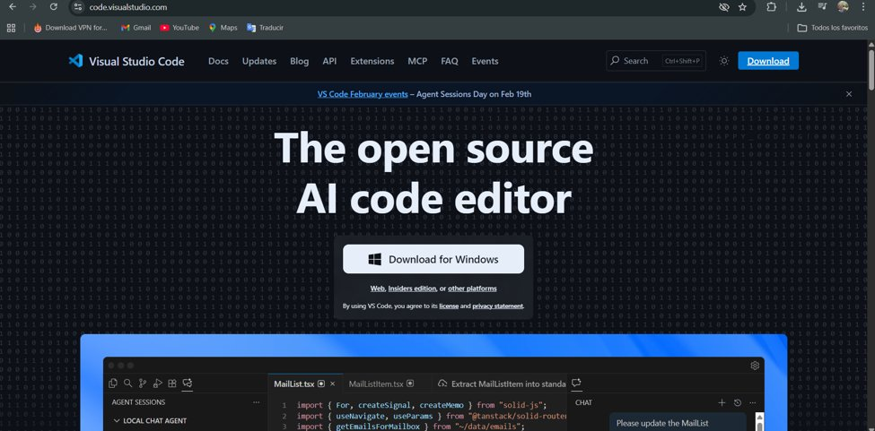
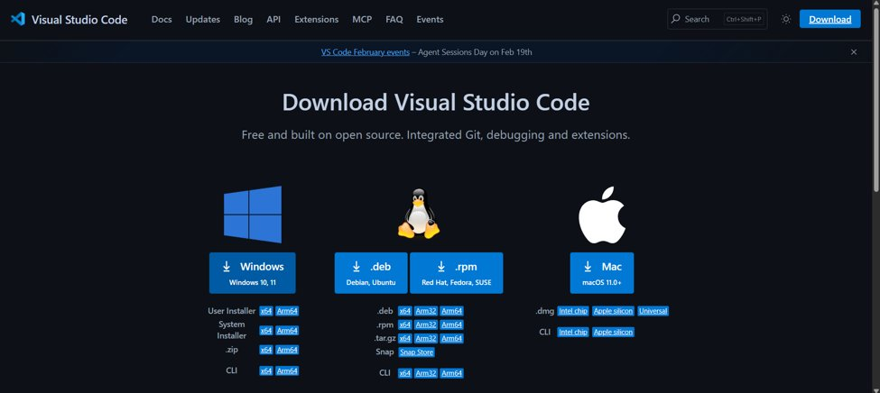
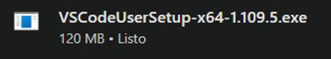
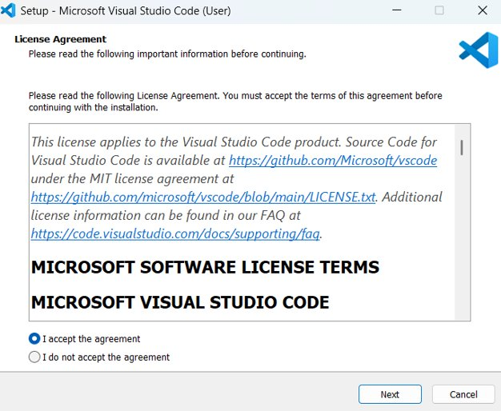
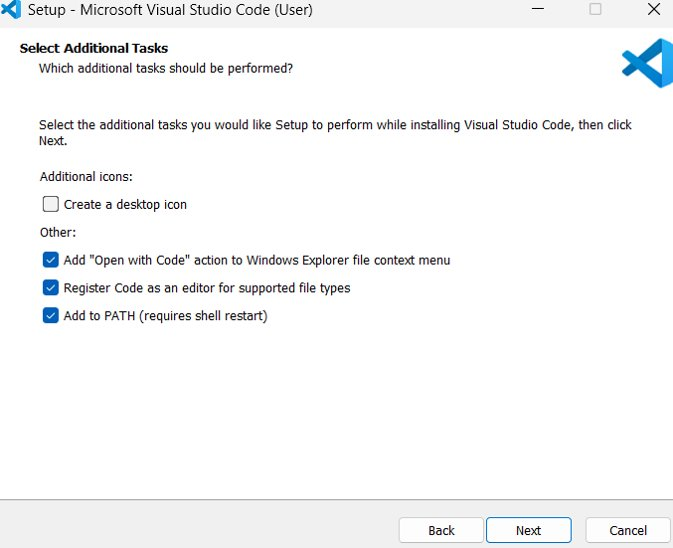
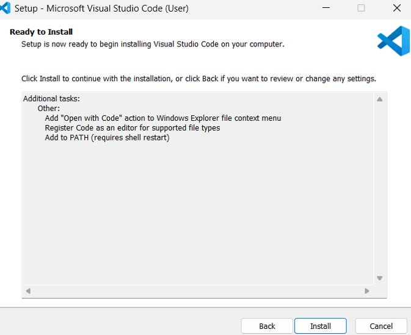
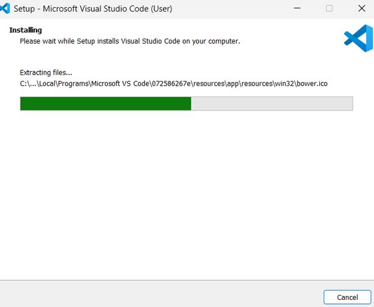
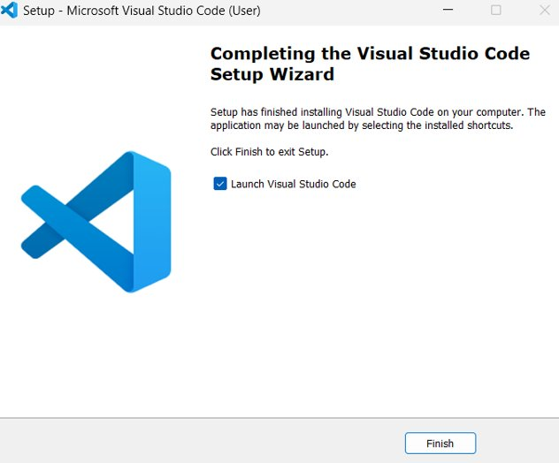
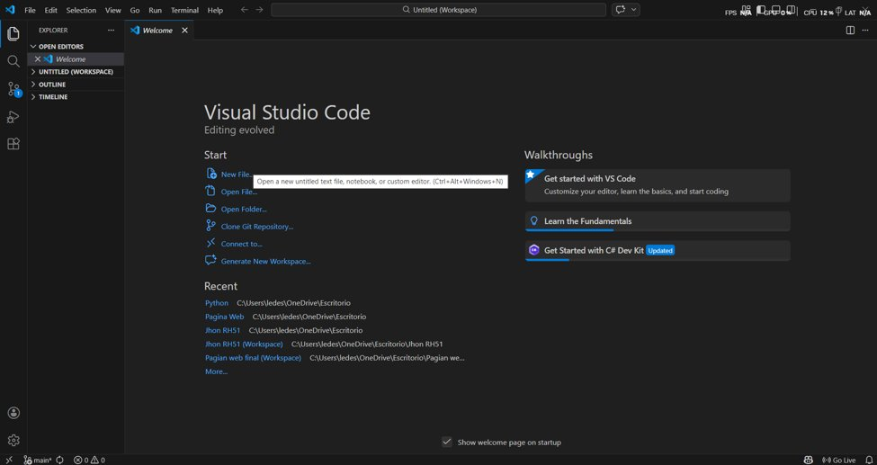

# 💻 Guía de Instalación de Visual Studio Code

**Sistema operativo:** Windows 10 / Windows 11  
**Autor:** Documentación Técnica Educativa  
**Versión del documento:** 2.0  
**Fecha:** Junio 2025  
**Nivel:** Principiante — no se requieren conocimientos previos

---

> *"Visual Studio Code es el editor de código más popular del mundo, utilizado por más de 73 millones de desarrolladores según la encuesta de Stack Overflow 2023."*

---

## 📋 Índice

1. [¿Qué es Visual Studio Code?](#1-qué-es-visual-studio-code)
2. [Requisitos del sistema en Windows](#2-requisitos-del-sistema-en-windows)
3. [Paso 1 — Visitar el sitio oficial](#3-paso-1--visitar-el-sitio-oficial)
4. [Paso 2 — Elegir el instalador para Windows](#4-paso-2--elegir-el-instalador-para-windows)
5. [Paso 3 — Descargar el instalador](#5-paso-3--descargar-el-instalador)
6. [Paso 4 — Aceptar el acuerdo de licencia](#6-paso-4--aceptar-el-acuerdo-de-licencia)
7. [Paso 5 — Seleccionar tareas adicionales](#7-paso-5--seleccionar-tareas-adicionales)
8. [Paso 6 — Confirmar e instalar](#8-paso-6--confirmar-e-instalar)
9. [Paso 7 — Progreso de instalación](#9-paso-7--progreso-de-instalación)
10. [Paso 8 — Finalizar la instalación](#10-paso-8--finalizar-la-instalación)
11. [Paso 9 — Verificar que VS Code funciona](#11-paso-9--verificar-que-vs-code-funciona)
12. [Configuración inicial recomendada](#12-configuración-inicial-recomendada)
13. [Comandos esenciales en Windows](#13-comandos-esenciales-en-windows)
14. [Extensiones recomendadas](#14-extensiones-recomendadas)
15. [Solución de problemas comunes](#15-solución-de-problemas-comunes)
16. [Conclusiones](#16-conclusiones)
17. [Recursos adicionales](#17-recursos-adicionales)

---

## 1. ¿Qué es Visual Studio Code?

**Visual Studio Code** (VS Code) es un editor de código fuente **gratuito** y de **código abierto** desarrollado por **Microsoft**. Está disponible para Windows, macOS y Linux, aunque esta guía se enfoca exclusivamente en su instalación en **Windows**.

### ¿Por qué elegir VS Code en Windows?

- ✅ **Gratuito y sin restricciones** — no requiere licencia de pago
- ✅ **Integración nativa con Windows** — funciona perfectamente con PowerShell, CMD y WSL
- ✅ **Ligero** — ocupa solo ~500 MB y abre en segundos
- ✅ **Soporte para más de 50 lenguajes** — HTML, CSS, JavaScript, Python, Java, C# y más
- ✅ **Miles de extensiones** disponibles en el Marketplace oficial
- ✅ **Git integrado** — sin necesidad de instalar herramientas externas para control de versiones
- ✅ **Terminal integrada** — PowerShell, CMD y Git Bash dentro del mismo editor

---

## 2. Requisitos del Sistema en Windows

Antes de instalar VS Code, asegúrate de que tu PC cumpla con los siguientes requisitos:

| Componente | Mínimo requerido | Recomendado |
|------------|-----------------|-------------|
| **Sistema Operativo** | Windows 10 versión 1703 | Windows 10/11 actualizado |
| **Procesador** | 1.6 GHz | 2.0 GHz o superior |
| **RAM** | 1 GB | 4 GB o más |
| **Espacio en disco** | 500 MB libres | 1 GB libres |
| **Resolución de pantalla** | 1024 × 768 | 1920 × 1080 |
| **Arquitectura** | x64 o x86 | x64 (64 bits) |

> **Nota:** VS Code funciona correctamente incluso en computadoras antiguas. Si tu PC tiene Windows 10 y al menos 2 GB de RAM, no tendrás ningún problema.

---

## 3. Paso 1 — Visitar el Sitio Oficial

Abre tu navegador (Chrome, Edge, Firefox) y dirígete a la página oficial de VS Code:

🌐 **[https://code.visualstudio.com](https://code.visualstudio.com)**



*La página principal de VS Code muestra el botón azul "Download for Windows" de forma prominente.*

El sitio detecta automáticamente tu sistema operativo y muestra el botón de descarga correspondiente a Windows.

> ⚠️ **Advertencia de seguridad:** Descarga VS Code **únicamente** desde el sitio oficial `code.visualstudio.com`. Nunca lo descargues desde sitios de terceros o páginas no oficiales para proteger tu equipo de posibles virus o malware.

---

## 4. Paso 2 — Elegir el Instalador para Windows

Al hacer clic en "Download" o visitar la página de descargas, verás las opciones disponibles para cada sistema operativo:



*La página de descargas muestra opciones para Windows, Linux y macOS.*

Para Windows, tienes dos tipos de instalador:

- **User Installer** *(recomendado para uso personal)* — instala VS Code solo para tu usuario, no requiere permisos de administrador
- **System Installer** — instala VS Code para todos los usuarios del equipo, requiere permisos de administrador

También puedes elegir la arquitectura:
- **x64** — para procesadores de 64 bits *(la mayoría de PCs modernos)*
- **x86** — para procesadores de 32 bits *(PCs muy antiguos)*
- **Arm64** — para procesadores ARM *(Surface Pro X, etc.)*

> 💡 **Recomendación:** Para la mayoría de usuarios, selecciona **User Installer → x64**.

---

## 5. Paso 3 — Descargar el Instalador

Una vez que hagas clic en la opción correcta, el archivo se descargará automáticamente. Lo verás aparecer en la parte inferior de tu navegador o en tu carpeta de **Descargas**:



*El instalador se llama `VSCodeUserSetup-x64-1.x.x.exe` y pesa aproximadamente 120 MB.*

El archivo tendrá un nombre similar a:
```
VSCodeUserSetup-x64-1.109.5.exe
```

Donde `1.109.5` es el número de versión, que puede variar según cuándo realices la descarga.

Para iniciar la instalación, **haz doble clic** sobre el archivo descargado.

---

## 6. Paso 4 — Aceptar el Acuerdo de Licencia

Al ejecutar el instalador, aparecerá la primera pantalla del asistente de instalación:



*El instalador solicita aceptar el acuerdo de licencia MIT de Microsoft antes de continuar.*

Pasos a seguir:
1. Lee el acuerdo de licencia (VS Code usa la **licencia MIT**, que es de código abierto y libre)
2. Selecciona la opción **"I accept the agreement"** (Acepto el acuerdo)
3. Haz clic en **Next** (Siguiente)

> **Dato importante:** La licencia MIT significa que VS Code es software libre. Puedes usarlo, copiarlo y modificarlo sin restricciones comerciales.

---

## 7. Paso 5 — Seleccionar Tareas Adicionales

Esta es la pantalla más importante de la instalación. Aquí defines las opciones extra que VS Code configurará en tu sistema:



*Se recomienda marcar las tres opciones de la sección "Other" para una integración completa con Windows.*

### Opciones recomendadas:

| Opción | ¿Marcar? | ¿Para qué sirve? |
|--------|----------|-----------------|
| Create a desktop icon | Opcional | Crea un ícono en el escritorio para acceso rápido |
| Add "Open with Code" to context menu | ✅ Sí | Permite abrir cualquier archivo con clic derecho → "Open with Code" |
| Register Code as an editor for supported file types | ✅ Sí | VS Code se convierte en el editor predeterminado para archivos de código |
| Add to PATH (requires shell restart) | ✅ Sí | Permite ejecutar `code` desde la terminal/CMD en cualquier carpeta |

Haz clic en **Next** cuando hayas marcado las opciones deseadas.

---

## 8. Paso 6 — Confirmar e Instalar

Antes de comenzar la instalación, el asistente muestra un resumen de todas las opciones seleccionadas:



*La pantalla "Ready to Install" muestra un resumen de las tareas adicionales que se ejecutarán.*

Revisa que las opciones mostradas sean correctas. Si necesitas cambiar algo, haz clic en **Back** (Atrás). Si todo está bien, haz clic en **Install** (Instalar) para iniciar el proceso.

---

## 9. Paso 7 — Progreso de Instalación

El instalador comenzará a copiar los archivos necesarios en tu computadora:



*La barra de progreso verde indica el avance de la instalación. El proceso tarda entre 1 y 3 minutos.*

Durante este proceso:
- No cierres la ventana del instalador
- No apagues ni reinicies tu computadora
- El proceso es completamente automático, no requiere ninguna acción de tu parte

El instalador copiará VS Code en la carpeta:
```
C:\Users\TuUsuario\AppData\Local\Programs\Microsoft VS Code\
```

---

## 10. Paso 8 — Finalizar la Instalación

Cuando la instalación termine, aparecerá la pantalla de finalización:



*La pantalla "Completing the Visual Studio Code Setup Wizard" confirma que la instalación fue exitosa.*

Asegúrate de que la casilla **"Launch Visual Studio Code"** esté marcada para que VS Code se abra automáticamente al hacer clic en **Finish** (Finalizar).

¡La instalación ha concluido exitosamente! 🎉

---

## 11. Paso 9 — Verificar que VS Code Funciona

Al hacer clic en Finish, VS Code se abrirá automáticamente mostrando la pantalla de bienvenida:



*La pantalla de bienvenida de VS Code muestra las opciones para crear archivos, abrir proyectos y acceder a tutoriales.*

Si ves esta pantalla, ¡la instalación fue un éxito! Desde aquí puedes:

- **New File...** — crear un nuevo archivo de código
- **Open File...** — abrir un archivo existente
- **Open Folder...** — abrir una carpeta completa como proyecto
- **Clone Git Repository...** — clonar un repositorio desde GitHub

### Verificación desde la terminal de Windows

También puedes verificar la instalación desde CMD o PowerShell:

```powershell
# Abre CMD o PowerShell y ejecuta:
code --version

# Resultado esperado (el número de versión puede variar):
# 1.109.5
# a86571364d8f5c5e73f47adce0e2eecd2b70f1df
# x64

# Abrir el directorio actual en VS Code:
code .

# Abrir un archivo específico:
code C:\Users\TuUsuario\Documents\mi_archivo.py
```

---

## 12. Configuración Inicial Recomendada

### Cambiar el idioma a Español

VS Code viene en inglés por defecto. Para cambiarlo:

```
1. Presiona Ctrl + Shift + P para abrir la paleta de comandos
2. Escribe: Configure Display Language
3. Selecciona "es" (Español)
4. Haz clic en "Restart" cuando se solicite
```

### Ajustes esenciales (settings.json)

Abre la configuración con `Ctrl + ,` y aplica estos ajustes básicos:

```json
{
  "editor.fontSize": 14,
  "editor.tabSize": 2,
  "editor.wordWrap": "on",
  "editor.formatOnSave": true,
  "editor.minimap.enabled": true,
  "files.autoSave": "afterDelay",
  "files.autoSaveDelay": 1000,
  "workbench.colorTheme": "Default Dark Modern",
  "editor.fontFamily": "Consolas, 'Courier New', monospace"
}
```

---

## 13. Comandos Esenciales en Windows

Los siguientes atajos de teclado son los más importantes para trabajar eficientemente en VS Code sobre Windows:

| Acción | Atajo en Windows | Descripción |
|--------|-----------------|-------------|
| Paleta de comandos | `Ctrl + Shift + P` | Accede a todas las funciones de VS Code |
| Terminal integrada | `` Ctrl + ` `` | Abre/cierra la terminal (PowerShell o CMD) |
| Nuevo archivo | `Ctrl + N` | Crea un archivo en blanco |
| Guardar archivo | `Ctrl + S` | Guarda el archivo actual |
| Buscar en archivo | `Ctrl + F` | Busca texto en el archivo actual |
| Buscar en proyecto | `Ctrl + Shift + F` | Busca en todos los archivos del proyecto |
| Comentar línea | `Ctrl + /` | Comenta o descomenta la línea seleccionada |
| Duplicar línea | `Shift + Alt + ↓` | Copia la línea actual hacia abajo |
| Formatear código | `Shift + Alt + F` | Formatea automáticamente el archivo |
| Abrir explorador de archivos | `Ctrl + Shift + E` | Muestra el panel lateral de archivos |
| Abrir extensiones | `Ctrl + Shift + X` | Accede al marketplace de extensiones |
| Ver/ocultar barra lateral | `Ctrl + B` | Muestra u oculta el panel izquierdo |

---

## 14. Extensiones Recomendadas

Las extensiones amplían las capacidades de VS Code. Para instalar una, presiona `Ctrl + Shift + X` y busca el nombre:

### Para desarrollo web:
- 🔵 **Prettier - Code formatter** — formatea automáticamente HTML, CSS y JavaScript
- 🟡 **ESLint** — detecta errores en JavaScript en tiempo real
- 🟠 **Live Server** — recarga automáticamente el navegador al guardar cambios

### Para productividad general:
- 🟣 **GitLens** — muestra el historial de Git directamente en el código
- 🔴 **Error Lens** — resalta errores y advertencias en la misma línea del código
- ⚫ **indent-rainbow** — colorea los niveles de indentación para mayor legibilidad

### Para lenguajes específicos:
- 🐍 **Python** (Microsoft) — soporte completo para Python con IntelliSense
- 🌐 **HTML CSS Support** — autocompletado de clases CSS en HTML
- 📄 **Markdown All in One** — herramientas avanzadas para escribir Markdown

---

## 15. Solución de Problemas Comunes

### ❌ El comando `code` no se reconoce en CMD/PowerShell

```powershell
# Verifica si VS Code está en el PATH:
echo $env:PATH

# Si no aparece, agrégalo manualmente en:
# Panel de control → Sistema → Configuración avanzada del sistema
# → Variables de entorno → PATH → Nuevo:
# C:\Users\TuUsuario\AppData\Local\Programs\Microsoft VS Code\bin

# Alternativa rápida: reinstala VS Code marcando "Add to PATH"
```

### ❌ Windows Defender bloquea el instalador

```
Solución:
1. Haz clic derecho sobre el archivo .exe descargado
2. Selecciona "Propiedades"
3. En la pestaña "General", marca "Desbloquear" al final
4. Haz clic en Aplicar y luego ejecuta el instalador nuevamente
```

### ❌ VS Code se abre pero se ve muy pequeño (pantallas 4K)

```json
// Ajusta el zoom en settings.json:
{
  "window.zoomLevel": 1
}
// O usa Ctrl + = para aumentar el zoom manualmente
```

### ❌ La terminal integrada no encuentra comandos de Python o Node

```powershell
# Cierra y vuelve a abrir VS Code después de instalar Python/Node
# Si persiste, verifica que el programa esté en el PATH de Windows:
python --version
node --version

# Si no funcionan, reinstala Python/Node marcando "Add to PATH"
```

---

## 16. Conclusiones

A lo largo de esta guía hemos documentado **paso a paso** el proceso completo de instalación de Visual Studio Code en Windows, desde la descarga hasta la verificación de que el programa funciona correctamente.

### Puntos clave aprendidos:

1. **VS Code es totalmente gratuito** y su instalación en Windows es sencilla, tomando menos de 5 minutos en completarse.
2. **La opción "Add to PATH"** es fundamental para poder usar el comando `code` desde la terminal y facilitar el flujo de trabajo como desarrollador.
3. **Las opciones del menú contextual** ("Open with Code") transforman el Explorador de Windows en una herramienta de desarrollo al permitir abrir cualquier carpeta directamente en el editor.
4. **Las extensiones son el verdadero poder de VS Code** — con las extensiones correctas se convierte en un entorno de desarrollo profesional para cualquier lenguaje.
5. **La pantalla de bienvenida** es el punto de partida para explorar todas las funcionalidades: crear archivos, abrir proyectos y acceder a tutoriales integrados.

### Lista de verificación final:

- [ ] VS Code instalado y abierto correctamente
- [ ] El comando `code` funciona desde CMD o PowerShell
- [ ] Idioma cambiado a español (opcional)
- [ ] Extensiones instaladas según tu lenguaje de programación
- [ ] Configuración guardada en settings.json

> *"Tener un buen entorno de desarrollo es el primer paso en el camino de cualquier programador. VS Code te da las herramientas; el resto depende de ti."*

---

## 17. Recursos Adicionales

- 🌐 **Sitio oficial:** [https://code.visualstudio.com](https://code.visualstudio.com)
- 📖 **Documentación completa:** [https://code.visualstudio.com/docs](https://code.visualstudio.com/docs)
- 🎥 **Videos introductorios:** [https://code.visualstudio.com/docs/introvideos/basics](https://code.visualstudio.com/docs/introvideos/basics)
- 🔌 **Marketplace de extensiones:** [https://marketplace.visualstudio.com/vscode](https://marketplace.visualstudio.com/vscode)
- ⌨️ **Referencia de atajos (Windows):** [https://code.visualstudio.com/shortcuts/keyboard-shortcuts-windows.pdf](https://code.visualstudio.com/shortcuts/keyboard-shortcuts-windows.pdf)
- 🐛 **Soporte y reportar errores:** [https://github.com/microsoft/vscode/issues](https://github.com/microsoft/vscode/issues)

---

*Documentación creada con fines educativos · Guía de instalación de VS Code en Windows · Versión 2.0 · Junio 2025*
